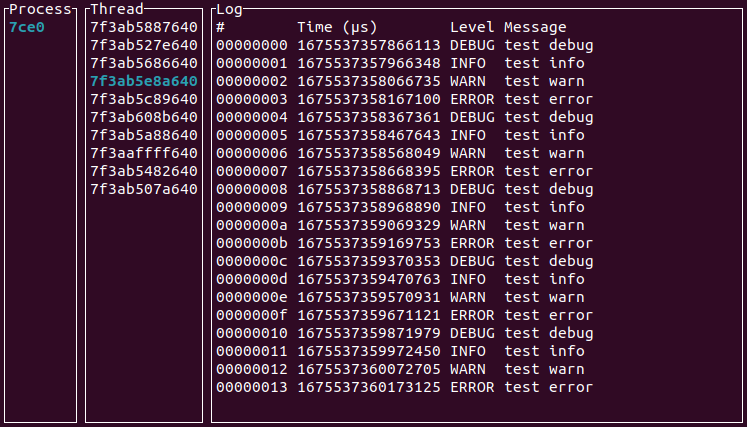

# multi-process-logger

A logger implementation for multi-process systems.



### Setup

Install the logger server:

```rust
cargo install logger-server --git https://github.com/JonathanWoollett-Light/multi-process-logger.git
```

Add the logger client dependency to your project:

```rust
logger-client = { git = "https://github.com/JonathanWoollett-Light/multi-process-logger.git", rev="b0520570589958f81c93f3fb24b4843d549d3c31" }
```

Within your project initialize the logger with:

```rust
Logger::init("/tmp/my-unix-socket", LevelFilter::Debug).unwrap();
```

### Example

```rust
use log::LevelFilter;
use logger_client::Logger;
use std::thread::sleep;
use std::time::Duration;

const SPACING: Duration = Duration::from_millis(100);
fn main() {
    Logger::init("./a-local-socket", LevelFilter::Debug).unwrap();

    let handles = (0..10)
        .map(|_| std::thread::spawn(tester))
        .collect::<Vec<_>>();
    for handle in handles {
        handle.join().unwrap();
    }
}

fn tester() {
    for _ in 0..5 {
        log::trace!("test trace");
        sleep(SPACING);
        log::debug!("test debug");
        sleep(SPACING);
        log::info!("test info");
        sleep(SPACING);
        log::warn!("test warn");
        sleep(SPACING);
        log::error!("test error");
        sleep(SPACING);
    }
}
```

This will spawn the server process if the socket is not found, otherwise it will attempt to connect to the socket.

### Server control


- `q` Exit
- `w` Up process
- `s` Down process
- `e` Up thread
- `d` Down thread

#### Log scrolling

Speed|Up|Down
---|---|---
1x|`r`|`f`
2x|`t`|`g`
4x|`y`|`h`
End|`u`|`j`

### FAQ

- What platforms are supported? Linux.
- Why is this not publish on crates.io? I use my own version of Nix (when a new version of Nix is published which includs https://github.com/nix-rust/nix/pull/1882 I may switch to it).
- Why doesn't it have/do X?  I haven't thought about it, feel free to submit an issue or PR.
